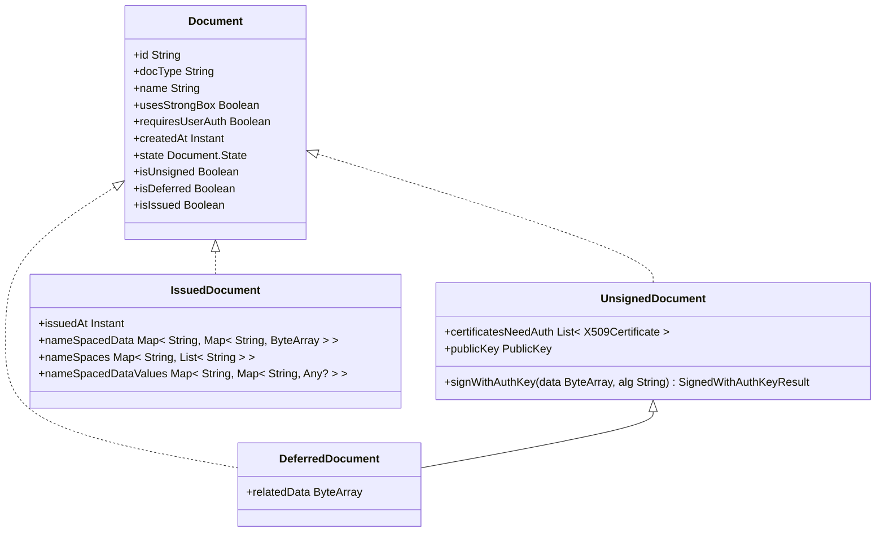

# EUDI Wallet Documents Manager library for Android

:heavy_exclamation_mark: **Important!** Before you proceed, please read
the [EUDI Wallet Reference Implementation project description](https://github.com/eu-digital-identity-wallet/.github/blob/main/profile/reference-implementation.md)

## Overview

This library provides a set of classes to manage documents in an EUDI Android Wallet.

It defines the interfaces for DocumentManager and Document classes and provides a standard
implementation
of the DocumentManager interface using Android Identity Credential API.

It also provides a sample implementation of the DocumentManager interface that can be used to load
sample documents and test the library.

The library is written in Kotlin and is available for Android.

## :heavy_exclamation_mark: Disclaimer

The released software is a initial development release version:

- The initial development release is an early endeavor reflecting the efforts of a short timeboxed period, and by no
  means can be considered as the final product.
- The initial development release may be changed substantially over time, might introduce new features but also may
  change or remove existing ones, potentially breaking compatibility with your existing code.
- The initial development release is limited in functional scope.
- The initial development release may contain errors or design flaws and other problems that could cause system or other
  failures and data loss.
- The initial development release has reduced security, privacy, availability, and reliability standards relative to
  future releases. This could make the software slower, less reliable, or more vulnerable to attacks than mature
  software.
- The initial development release is not yet comprehensively documented.
- Users of the software must perform sufficient engineering and additional testing in order to properly evaluate their
  application and determine whether any of the open-sourced components is suitable for use in that application.
- We strongly recommend not putting this version of the software into production use.
- Only the latest version of the software will be supported

## Requirements

- Android 8 (API level 26) or higher

### Dependencies

To use snapshot versions add the following to your project's settings.gradle file:

```groovy

dependencyResolutionManagement {
    repositories {
        // ...
        maven {
            url = uri("https://s01.oss.sonatype.org/content/repositories/snapshots/")
            mavenContent { snapshotsOnly() }
        }
        // ...
    }
}
```

To include the library in your project, add the following dependencies to your app's build.gradle
file.

```groovy
dependencies {
    implementation "eu.europa.ec.eudi:eudi-lib-android-wallet-document-manager:0.4.3"
}
```

## How to Use

Below is a quick overview of how to use the library.

For source code documentation, see in [docs](docs/index.md) directory.

### Instantiating the DocumentManager

The library provides
a [`DocumentManager`](docs/document-manager/eu.europa.ec.eudi.wallet.document/-document-manager/index.md) class
implementation to manage documents. To create an instance of
the [`DocumentManager`](docs/document-manager/eu.europa.ec.eudi.wallet.document/-document-manager/index.md), the library
provides a [`Builder`](docs/document-manager/eu.europa.ec.eudi.wallet.document/-document-manager/-builder/index.md),
that can be used to get a default implementation of the `DocumentManager`.

```kotlin
import eu.europa.ec.eudi.wallet.document.DocumentManager

val documentManager = DocumentManager.Builder(context)
    .useEncryption(true)
    .storageDir(context.noBackupFilesDir)
    .enableUserAuth(true)
    .userAuthTimeout(30000)
    .build()
```

### Managing documents

A document can be in one of the three following states:

- **Unsigned** the document is not yet issued and has no data from the issuer. Contains only the keys that will be used
  for
  issuance
- **Deferred** the document is not yet received from the issuer, but the issuer has received the document's public key
  and proof of possession. It also holds some related to the deferred issuance process, that can be used for the
  completion of issuance.
- **Issued** the document is issued and contains the data received from the issuer

The following diagram depicts the class hierarchy of the Document classes:



To retrieve the list of documents, use
the [`DocumentManager.getDocuments`](docs/document-manager/eu.europa.ec.eudi.wallet.document/-document-manager/get-documents.md)
method.
The method receives an optional
argument [`state`](docs/document-manager/eu.europa.ec.eudi.wallet.document/-document/-state/index.md) to filter the
documents by
their state. In the following example, the
method is used to retrieve all issued documents:

```kotlin
import eu.europa.ec.eudi.wallet.document.Document

val documents: List<Document> = documentManager.getDocuments(state = Document.State.ISSUED)
```

To retrieve a document by its id, use
the [`DocumentManager.getDocumentById`](docs/document-manager/eu.europa.ec.eudi.wallet.document/-document-manager/get-document-by-id.md)
method:

```kotlin
import eu.europa.ec.eudi.wallet.document.Document

val documentId = "some document id"
val document: Document = documentManager.getDocumentById(documentId)
```

DocumentManager also provides
the [`DocumentManager.deleteDocumentById`](docs/document-manager/eu.europa.ec.eudi.wallet.document/-document-manager/delete-document-by-id.md)
method to delete a document by its id:

```kotlin
import eu.europa.ec.eudi.wallet.document.Document
import eu.europa.ec.eudi.wallet.document.DeleteDocumentResult

val documentId = "some document id"
val deleteResult: DeleteDocumentResult = documentManager.deleteDocumentById(documentId)

when (deleteResult) {
    is DeleteDocumentResult.Success -> {
        // document deleted successfully
        val proofOfDeletion = deleteResult.proofOfDeletion
    }
    is DeleteDocumentResult.Failure -> {
        // handle error while deleting document
    }
}

```

To add a new document
in [`DocumentManager`](docs/document-manager/eu.europa.ec.eudi.wallet.document/-document-manager/index.md), the
following
steps should be followed:

1. Create a new document using
   the [`DocumentManager.createDocument`](docs/document-manager/eu.europa.ec.eudi.wallet.document/-document-manager/create-document.md)
   From the return result of this method you can get
   the [`UnsignedDocument`](docs/document-manager/eu.europa.ec.eudi.wallet.document/-unsigned-document/index.md) object.
2. Use
   the [`UnsignedDocument.publicKey`](docs/document-manager/eu.europa.ec.eudi.wallet.document/-unsigned-document/public-key.md)
   property for the issuer and
   the [`UnsignedDocument.signWithAuthKey`](docs/document-manager/eu.europa.ec.eudi.wallet.document/-unsigned-document/sign-with-auth-key.md)
   method to sign the proof of possession for the document's public key.
3. When the document's cbor data is received from the issuer, use
   the [`DocumentManager.storeIssuedDocument`](docs/document-manager/eu.europa.ec.eudi.wallet.document/-document-manager/store-issued-document.md)
   to store the issued document. If the issuer responds with a deferred issuance, use
   the [`DocumentManager.storeDeferredDocument`](docs/document-manager/eu.europa.ec.eudi.wallet.document/-document-manager/store-deferred-document.md)
   to store the deferred document and related data from the issuer's response.

[`DocumentManager.storeIssuedDocument`](docs/document-manager/eu.europa.ec.eudi.wallet.document/-document-manager/store-issued-document.md)
method expects document's data to be in CBOR bytes and have the IssuerSigned structure according to ISO 23220-4 __*__ :

```cddl
IssuerSigned = {
 ?"nameSpaces" : IssuerNameSpaces, ; Returned data elements
 "issuerAuth" : IssuerAuth ; Contains the mobile security object (MSO) for issuer data authentication
}
IssuerNameSpaces = { ; Returned data elements for each namespace
 + NameSpace => [ + IssuerSignedItemBytes ]
}
IssuerSignedItemBytes = #6.24(bstr .cbor IssuerSignedItem)
IssuerSignedItem = {
 "digestID" : uint, ; Digest ID for issuer data authentication
 "random" : bstr, ; Random value for issuer data authentication
 "elementIdentifier" : DataElementIdentifier, ; Data element identifier
 "elementValue" : DataElementValue ; Data element value
}
IssuerAuth = COSE_Sign1 ; The payload is MobileSecurityObjectBytes
```

__*__**Important note**: Currently, the library does not support IssuerSigned structure without the `nameSpaces` field.

See the code below for an example of how to add a new document
in [`DocumentManager`](docs/document-manager/eu.europa.ec.eudi.wallet.document/-document-manager/index.md):

```kotlin
val docType = "eu.europa.ec.eudi.pid.1"
val hardwareBacked = false
val attestationChallenge = byteArrayOf(
    // attestation challenge bytes
    // provided by the issuer
)
val result = documentManager.createDocument(docType, hardwareBacked, attestationChallenge)
when (result) {
    is CreateIssuanceRequestResult.Failure -> {
        val error = result.throwable
        // handle error
    }

    is CreateIssuanceRequestResult.Success -> {
        val unsignedDocument = result.issuanceRequest
        val docType = unsignedDocument.docType
        // the device certificate that will be used in the signing of the document
        // from the issuer while creating the MSO (Mobile Security Object)
        val certificateNeedAuth = unsignedDocument.certificateNeedAuth
        // or
        val publicKey = unsignedDocument.publicKey

        // if the issuer requires the user to prove possession of the private key corresponding to the certificateNeedAuth,
        // then the user can use the method below to sign issuer's data and send the signature to the issuer
        val signingInputFromIssuer = byteArrayOf(
            // signing input bytes from the issuer
            // provided by the issuer
        )
        val signatureResult = unsignedDocument.signWithAuthKey(signingInputFromIssuer)
        when (signatureResult) {
            is SignedWithAuthKeyResult.Success -> {
                val signature = signatureResult.signature
                // signature for the issuer
            }
            is SignedWithAuthKeyResult.Failure -> {
                val error = signatureResult.throwable
                // handle error while signing with an auth key
            }
            is SignedWithAuthKeyResult.UserAuthRequired -> {
                // user authentication is required to sign with an auth key
                val cryptoObject = signatureResult.cryptoObject
                // use cryptoObject to authenticate the user
                // after user authentication, the user can sign with an auth key again
            }
        }

        // ... code that sends docType and certificates to issuer and signature if required

        // after receiving the MSO from the issuer, the user can start the issuance process
        val issuerData: ByteArray = byteArrayOf(
            // CBOR bytes of the document
        )

        val storeResult = documentManager.storeIssuedDocument(unsignedDocument, issuerData)

        when (storeResult) {
            is AddDocumentResult.Failure -> {
                val error = storeResult.throwable
                // handle error while adding a document
            }
            is AddDocumentResult.Success -> {
                val documentId = storeResult.documentId
                // the documentId of the newly added document
                // use the documentId to retrieve the document
                documentManager.getDocumentById(documentId)
            }
        }
    }
}
```

The library provides the extension
method [`IssuedDocument.nameSpacedDataJSONObject`](docs/document-manager/eu.europa.ec.eudi.wallet.document/name-spaced-data-j-s-o-n-object.md)
that returns the document's nameSpaced data as JSONObject.

```kotlin
import org.json.JSONObject

val document = documentManager.getDocumentById("some_document_id") as IssuedDocument
val documentDataAsJson: JSONObject? = document?.nameSpacedDataJSONObject
```

### Working with sample documents

The library also provides
a [`SampleDocumentManager`](docs/document-manager/eu.europa.ec.eudi.wallet.document.sample/-sample-document-manager/index.md)
implementation that can be used to load sample documents and test the library easily.

To create a new instance of
the [`SampleDocumentManager`](docs/document-manager/eu.europa.ec.eudi.wallet.document.sample/-sample-document-manager/index.md)
class, use
the [`SampleDocumentManager.Builder`](docs/document-manager/eu.europa.ec.eudi.wallet.document.sample/-sample-document-manager/-builder/index.md)
class:

```kotlin
import eu.europa.ec.eudi.wallet.document.sample.SampleDocumentManager

val sampleDocumentManager = SampleDocumentManager.Builder(context)
    .documentManager(documentManager) // optional, if a DocumentManager instance is already created, else a default DocumentManager instance will be created
    .hardwareBacked(false) // Documents' keys should be stored in a hardware-backed keystore if supported by the device. The default value is true if the device supports a hardware-backed keystore, else false
    .build()
```

You can load the sample documents
using
the [`SampleDocumentManager.loadSampleData`](docs/document-manager/eu.europa.ec.eudi.wallet.document.sample/-sample-document-manager/load-sample-data.md)
method like shown below:

```kotlin
import android.util.Base64

// Assuming that the sample data is stored in a file named sample_data.json in the raw resources directory
// in base64 encoded format and context is an instance of android.content.Context
val sampleDocumentsByteArray = context.resources.openRawResource(R.raw.sample_data).use {
    val data = String(it.readBytes())
    Base64.decode(data, Base64.DEFAULT)
}
documentManager.loadSampleData(sampleDocumentsByteArray)
```

Sample documents must be in CBOR format with the following structure:

```cddl
SampleData = {
 "documents" : [+Document], ; Returned documents
}
Document = {
 "docType" : DocType, ; Document type returned
 "issuerSigned" : IssuerSigned, ; Returned data elements signed by the issuer
}
IssuerSigned = {
 "nameSpaces" : IssuerNameSpaces, ; Returned data elements
}
IssuerNameSpaces = { ; Returned data elements for each namespace
 + NameSpace => [ + IssuerSignedItemBytes ]
}
IssuerSignedItem = {
 "digestID" : uint, ; Digest ID for issuer data authentication
 "random" : bstr, ; Random value for issuer data authentication
 "elementIdentifier" : DataElementIdentifier, ; Data element identifier
 "elementValue" : DataElementValue ; Data element value
}
```

## How to contribute

We welcome contributions to this project. To ensure that the process is smooth for everyone
involved, follow the guidelines found in [CONTRIBUTING.md](CONTRIBUTING.md).

## License

### Third-party component licenses

See [licenses.md](licenses.md) for details.

### License details

Copyright (c) 2023 European Commission

Licensed under the Apache License, Version 2.0 (the "License");
you may not use this file except in compliance with the License.
You may obtain a copy of the License at

    http://www.apache.org/licenses/LICENSE-2.0

Unless required by applicable law or agreed to in writing, software
distributed under the License is distributed on an "AS IS" BASIS,
WITHOUT WARRANTIES OR CONDITIONS OF ANY KIND, either express or implied.
See the License for the specific language governing permissions and
limitations under the License.
