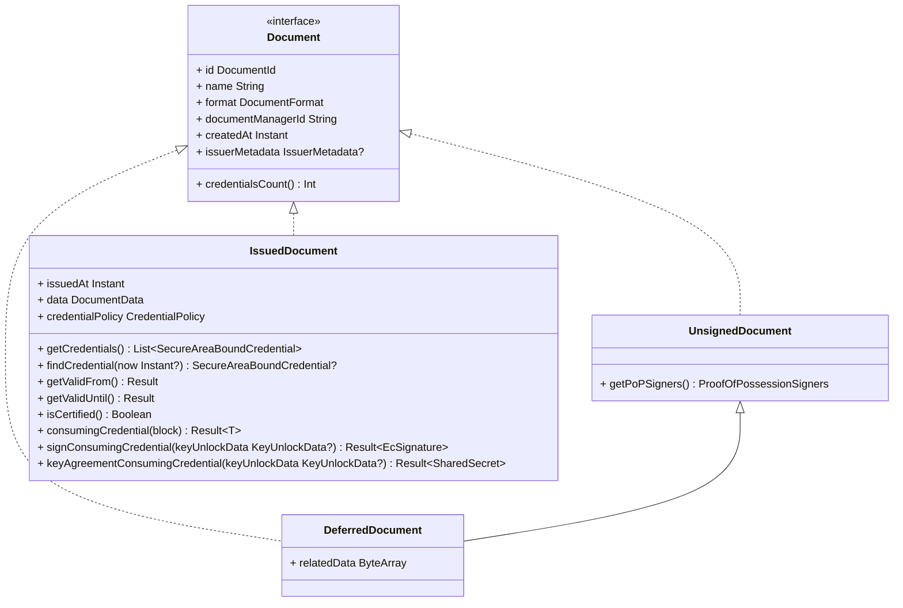

# EUDI Wallet Documents Manager library for Android

:heavy_exclamation_mark: **Important!** Before you proceed, please read
the [EUDI Wallet Reference Implementation project description](https://github.com/eu-digital-identity-wallet/.github/blob/main/profile/reference-implementation.md)

## Overview

This library provides a set of classes to manage documents in an EUDI Android Wallet.

It defines the interfaces for DocumentManager and Document classes and provides a standard
implementation of the DocumentManager interface using Identity Credential library by the
OpenWallet Foundation.

Key features include:

- **Multiple Credential Support**: Create multiple credentials per document for enhanced privacy and
  security
- **Credential Policies**: Manage credential lifecycle with one-time use or rotate use policies
- **Multiple Document Formats**: Support for both MSO mDOC (ISO 18013-5) and SD-JWT VC (
  draft-ietf-oauth-selective-disclosure-jwt-12) formats
- **Enhanced Security**: Advanced key management and secure credential storage
- **Metadata Support**: Rich display information and claim metadata for improved user experience

The library is written in Kotlin.

## Disclaimer

The released software is an initial development release version:

- The initial development release is an early endeavor reflecting the efforts of a short timeboxed
  period, and by no means can be considered as the final product.
- The initial development release may be changed substantially over time, might introduce new
  features but also may change or remove existing ones, potentially breaking compatibility with your
  existing code.
- The initial development release is limited in functional scope.
- The initial development release may contain errors or design flaws and other problems that could
  cause system or other failures and data loss.
- The initial development release has reduced security, privacy, availability, and reliability
  standards relative to future releases. This could make the software slower, less reliable, or more
  vulnerable to attacks than mature software.
- The initial development release is not yet comprehensively documented.
- Users of the software must perform sufficient engineering and additional testing in order to
  properly evaluate their application and determine whether any of the open-sourced components is
  suitable for use in that application.
- We strongly recommend not putting this version of the software into production use.
- Only the latest version of the software will be supported

## Requirements

- Android 8 (API level 26) or higher

### Dependencies

To use snapshot versions add the following to your project's settings.gradle file:

```kotlin
dependencyResolutionManagement {
    repositories {
        // .. other repositories
        maven {
          url = uri("https://central.sonatype.com/repository/maven-snapshots/")
            mavenContent { snapshotsOnly() }
        }
    }
}
```

To include the library in your project, add the following dependencies to your app's build.gradle
file.

```kotlin
dependencies {
    // EUDI Wallet Documents Manager library
  implementation("eu.europa.ec.eudi:eudi-lib-android-wallet-document-manager:0.11.2")

    // Optional: Use the multipaz-android library if you want to use the implementations for Storage and SecureArea
    // for Android devices, provided by the OpenWallet Foundation
    implementation("org.multipaz:multipaz-android:0.90")
}
```

## How to Use

Below is a quick overview of how to use the library.

For source code documentation, see in [docs](docs/index.md) directory.

### Instantiating the DocumentManager

To create an instance of the DocumentManager class, use the DocumentManager.Builder class.
Builder requires a Storage and SecureArea instance to be set before building the
DocumentManager.

The following code snippet shows an example on how to create EphemeralStorage and
SoftwareSecureArea instances, provided by the Identity Credential library, and use them later to
create a DocumentManager instance.

Any implementations of Storage and SecureArea can be used.

```kotlin
val storage = EphemeralStorage()
val secureArea = SoftwareSecureArea.create(storage)
val secureAreaRepository = SecureAreaRepository.build {
    add(secureArea)
}
```

To use the DocumentManager with the Multipaz library for android, you must add the
`org.multipaz:multipaz-android:0.90` dependency to your project, and use the provided
implementations for Storage and SecureArea for Android devices.

```kotlin
val builder = DocumentManager.Builder()
    .setIdentifier("eudi_wallet_document_manager")
    .setStorage(storage)
    .setSecureAreaRepository(secureAreaRepository)

val documentManager = builder.build()
```

### Managing documents

A document can be in one of the three following states:

- **Unsigned** the document is not yet issued and has no data from the issuer. Contains only the
  keys that will be used for signing the proof of possession for the issuer.
- **Deferred** the document is not yet received from the issuer, but the issuer has received the
  document's public key and proof of possession. It also holds some related to the deferred issuance
  process that can be used for the completion of issuance.
- **Issued** the document is issued and contains the data received from the issuer

The following diagram depicts the class hierarchy of the Document classes:



The following snippet shows how to retrieve the documents using DocumentManager instance:

```kotlin
val documents = documentManager.getDocuments()
```

You can also retrieve documents based on a predicate. The following snippet shows how to retrieve
documents of mso_mdoc format of a specific docType:

```kotlin
val documents = documentManager.getDocuments { document ->
    (document.format as MsoMdocFormat).docType == "eu.europa.ec.eudi.pid.1"
}
```

The following snippet shows how to retrieve a document by its id:

```kotlin
val documentId = "some_document_id"
val document: Document? = documentManager.getDocumentById(documentId)
```

To delete a document, use the following code snippet:

```kotlin
try {
    val documentId = "some_document_id"
    val deleteResult = documentManager.deleteDocumentById(documentId)
    deleteResult.getOrThrow()
} catch (e: Throwable) {
    // Handle the exception
}
```

### Creating and storing a new document

Adding a new document to the DocumentManager is a two-step process. First, a new document must be
created using the createDocument method. The method returns an UnsignedDocument object that contains
the keys that will be used for signing the proof of possession for the issuer. Creating a new
document requires the document format and a CreateDocumentSettings object. The latter is needed to
specify the secure area identifier and the create key settings that will be used to create the key.

After the document is created, the user must retrieve the document's data from the issuer and store
it in the DocumentManager using the storeIssuedDocument method.

### Multiple Credential Support

Library supports creating multiple credentials per document. This feature allows for enhanced
privacy and security by enabling credential rotation and managing credential policies.

The `CreateDocumentSettings` now includes a `numberOfCredentials` parameter:

```kotlin
val createSettings = CreateDocumentSettings(
    secureAreaIdentifier = secureArea.identifier,
    createKeySettings = SoftwareCreateKeySettings.Builder().build(),
    numberOfCredentials = 3 // Create 3 credentials for this document (default is 1)
)
```

**Important Notes:**

- The `numberOfCredentials` parameter must be greater than 0
- Each credential within a document shares the same document data but has its own unique key pair
- Multiple credentials enable advanced privacy features by allowing credential rotation or
  single-use policies

### Credential Policies

The library supports credential policies that determine how credentials are managed after use:

#### OneTimeUse Policy

Credentials with this policy are automatically deleted after a single use:

```kotlin
val createSettings = CreateDocumentSettings(
    secureAreaIdentifier = secureArea.identifier,
    createKeySettings = SoftwareCreateKeySettings.Builder().build(),
    numberOfCredentials = 5,
    credentialPolicy = CredentialPolicy.OneTimeUse
)
```

#### RotateUse Policy (Default)

Credentials with this policy increment their usage count but remain available for reuse:

```kotlin
val createSettings = CreateDocumentSettings(
    secureAreaIdentifier = secureArea.identifier,
    createKeySettings = SoftwareCreateKeySettings.Builder().build(),
    numberOfCredentials = 3,
    credentialPolicy = CredentialPolicy.RotateUse // This is the default
)
```

### Working with Credentials in Issued Documents

Issued documents provide methods to work with individual credentials:

```kotlin
val issuedDocument = documentManager.getDocumentById("document_id") as? IssuedDocument
requireNotNull(issuedDocument)

// Get the number of valid credentials for the document
val numberOfValidCredentials = issuedDocument.credentialsCount()

// Get the initial number of credentials for the document
val initialNumberOfCredentials = issuedDocument.initialCredentialsCount()

// Get a list of all valid credentials for the document
val validCredentials = issuedDocument.getCredentials()

// Find an available credential (automatically selects the best one based on policy)
val credential = issuedDocument?.findCredential()

// Use a credential and apply the policy (e.g., delete if OneTimeUse, increment usage if RotateUse)
issuedDocument?.consumingCredential {
    // Use the credential for presentation or other operations
    // The credential policy will be applied automatically after this block
    performPresentationWithCredential(this)
}
```

The `findCredential()` method intelligently selects credentials based on:

- Credential policy (e.g., OneTimeUse or RotateUse)
- Usage count (selecting least-used credentials first in RotateUse policy)
- Validity period (ensuring the credential is currently valid)
- Availability (excluding deleted or invalidated credentials)

### Document Creation Example

The following snippet demonstrates how to create a new document for the mso_mdoc format with
multiple credentials:

```kotlin
// create a new document with multiple credentials
val createSettings = CreateDocumentSettings(
    secureAreaIdentifier = SoftwareSecureArea.IDENTIFIER,
    createKeySettings = SoftwareCreateKeySettings.Builder().build(),
    numberOfCredentials = 3, // Create 3 credentials
    credentialPolicy = CredentialPolicy.OneTimeUse // Delete after single use
)

// Get or create metadata for the document
val issuerMetadata: IssuerMetadata = TODO("Retrieve metadata from issuer")

val createDocumentResult = documentManager.createDocument(
    format = MsoMdocFormat(docType = "eu.europa.ec.eudi.pid.1"),
    createSettings = createSettings,
    issuerMetadata = issuerMetadata  // Adds display information and claim details
)

val unsignedDocument = createDocumentResult.getOrThrow()
val popSigners = unsignedDocument.getPoPSigners()


// prepare keyUnlockData to unlock the key
val keyUnlockData = SoftwareKeyUnlockData(
    passphrase = "passphrase required to unlock the key"
)

// proof of key possession
val publicKeys = popSigners.map { it.getKeyInfo().publicKey.toCoseBytes }
val dataToSignFromIssuer: ByteArray = TODO("Data to sign from issuer for proof of key possession")
val proofs = popSigners
    .map { it.signPoP(dataToSignFromIssuer, keyUnlockData = keyUnlockData) }
    .map { it.toCoseEncoded() }
// send the public keys and the signature proofs to the issuer

val documentData: List<IssuerProvidedCredential> =
    TODO("Retrieve document data from issuer. This is a list of credentials")

// store the issued document with the document data received from the issuer
val storeResult =
    documentManager.storeIssuedDocument(unsignedDocument, documentData)

// get the issued document (now contains multiple credentials)
val issuedDocument = storeResult.getOrThrow()
```

**Important!:** In the case of `MsoMdocFormat`, `DocumentManager.storeIssuedDocument()`
method expects
credentials' data to be in CBOR bytes and have the IssuerSigned structure according to ISO 23220-4.
Currently, the library does not support IssuerSigned structure without the `nameSpaces` field.

The following CDDL schema describes the structure of the IssuerSigned structure:

```cddl
IssuerSigned = {
 ?"nameSpaces" : IssuerNameSpaces, ; Returned data elements
 "issuerAuth" : IssuerAuth ; Contains the mobile security object (MSO) for issuer data authentication
}
IssuerNameSpaces = { ; Returned data elements for each namespace
 + NameSpace => [ + IssuerSignedItemBytes ]
}
IssuerSignedItemBytes = #6.24(bstr .cbor IssuerSignedItem)
IssuerSignedItem = {
 "digestID" : uint, ; Digest ID for issuer data authentication
 "random" : bstr, ; Random value for issuer data authentication
 "elementIdentifier" : DataElementIdentifier, ; Data element identifier
 "elementValue" : DataElementValue ; Data element value
}
IssuerAuth = COSE_Sign1 ; The payload is MobileSecurityObjectBytes
```

#### Working with SD-JWT VC Data

SD-JWT VC documents provide access to both the original JWT format and decoded claim data:

```kotlin
val sdJwtVcDocument = documentManager.getDocumentById("document_id") as? IssuedDocument
// Check if the document is an SD-JWT VC document
requireNotNull(sdJwtVcDocument)
require(sdJwtVcDocument.format is SdJwtVcFormat)

// Access the original SD-JWT VC string from the credential 
val sdJwtVc = sdJwtVcDocument.findCredential()?.issuerProvidedData?.let { String(it) }
```

**Note:** For `SdJwtVcFormat`, the `DocumentManager.storeIssuedDocument()` method expects the
document data to be a valid SD-JWT VC string as defined in the specification.

### Document metadata

The library provides robust support for document metadata through the `IssuerMetadata` class. This
metadata includes display information, claim details, and issuer information that enhances the user
experience when working with and presenting documents.

#### IssuerMetadata structure

The `IssuerMetadata` class contains:

- `documentConfigurationIdentifier`: Unique identifier for the document configuration
- `display`: List of display properties (name, logo, colors, etc.) for different locales
- `claims`: Optional metadata about document claims, including display properties and whether
  they're mandatory
- `credentialIssuerIdentifier`: Identifier for the credential issuer
- `issuerDisplay`: Optional display properties for the issuer

Each `Display` object can include:

- `name`: The display name of the document (required)
- `locale`: Language/locale information
- `logo`: Visual representation of the document
- `description`: Explanatory text about the document
- `backgroundColor`, `textColor`: Visual styling properties
- `backgroundImageUri`: URI to a background image

#### Working with IssuerMetadata

You can access document metadata through the `issuerMetadata` property on any Document object:

```kotlin
val document = documentManager.getDocumentById("some_document_id")
val metadata = document?.issuerMetadata

// Check if the document has display information in the user's preferred locale
val userLocale = Locale.getDefault()
val localizedDisplay = metadata?.display?.find { it.locale == userLocale }

// Access claim metadata
metadata?.claims?.forEach { claim ->
  // Process each claim with its display information
  val claimPath = claim.path // Contains namespace and identifier information
  val claimDisplays = claim.display // Contains localized names for the claim
  val isMandatory = claim.mandatory ?: false
  // Use this information in your UI
}

// Access issuer display information
val issuerName = metadata?.issuerDisplay?.firstOrNull()?.name
val issuerLogo = metadata?.issuerDisplay?.firstOrNull()?.logo?.uri
```

#### Creating and parsing IssuerMetadata

You can create `IssuerMetadata` from JSON or convert it to JSON:

```kotlin
// Parse from JSON
val jsonMetadata = """{"documentConfigurationIdentifier":"eu.europa.ec.eudi.pid.1", ...}"""
val metadata = IssuerMetadata.fromJson(jsonMetadata).getOrThrow()

// Convert to JSON
val jsonString = metadata.toJson()

// Handle potential parsing errors safely
IssuerMetadata.fromJson(jsonString).fold(
  onSuccess = { validMetadata ->
    // Use the metadata
  },
  onFailure = { error ->
    // Handle parsing error
  }
)
```

This metadata system allows for rich document visualization and user-friendly presentations by
providing localized names, descriptions, colors, and logos for documents and their claims.

### Enhanced Document Features

The library provides several enhanced features for working with issued documents:

#### Document Validation

Check if a document is valid:

```kotlin
val issuedDocument = documentManager.getDocumentById("document_id") as? IssuedDocument
val currentlyValidCredential = issuedDocument?.findCredential() != null
```

#### Document Certification

Documents can be certified to verify their authenticity:

```kotlin
val issuedDocument = documentManager.getDocumentById("document_id") as? IssuedDocument
val isCertified = issuedDocument?.isCertified() == true

// Check if any of the document's key has been invalidated
val invalidatedKeys: Map<String, Boolean> = issuedDocument?.getCredentials()
    ?.associate { it.alias to it.isInvalidated() }
    ?: emptyMap()
```

#### Data Access Methods

Access document data in various formats:

```kotlin
val issuedDocument = documentManager.getDocumentById("document_id") as? IssuedDocument

requireNotNull(issuedDocument)
// Access the given_name claim from the document
val givenNameClaim = when (val data = issuedDocument.data) {
  is MsoMdocData -> data.claims
    .find { it.nameSpace == "eu.europa.ec.eudi.pid.1" && it.identifier == "given_name" }

  is SdJwtVcData -> data.claims
    .find { it.identifier == "given_name" }
}
val givenName = givenNameClaim?.value as String
val givenNameDisplay = givenNameClaim.issuerMetadata?.display
  ?.find { it.locale == Locale.getDefault() }
```

### Working with sample documents

The library also provides a `SampleDocumentManager` implementation that can be used to load sample
documents and test the library easily. Currently, the library supports loading sample documents in
MsoMdoc format.

The following code snippet shows how to create an instance of the `SampleDocumentManager` class and
load sample documents:

```kotlin
val sampleDocumentManager = SampleDocumentManager.Builder()
    .setDocumentManager(documentManager)
    .build()

val sampleMdocDocuments: ByteArray = readFileWithSampleData()

val createSettings = CreateDocumentSettings(
    secureAreaIdentifier = SoftwareSecureArea.IDENTIFIER,
    createKeySettings = SoftwareCreateKeySettings.Builder().build(),
    numberOfCredentials = 3, // Create multiple credentials for sample documents
    credentialPolicy = CredentialPolicy.RotateUse
)
val loadResult = sampleDocumentManager.loadMdocSampleDocuments(
    sampleData = sampleMdocDocuments,
    createSettings = createSettings,
    documentNamesMap = mapOf(
        "eu.europa.ec.eudi.pid.1" to "EU PID",
        "org.iso.18013.5.1.mDL" to "mDL"
    )
)

val documentIds: List<DocumentId> = loadResult.getOrThrow()

// ...

fun readFileWithSampleData(): ByteArray = TODO("Reads the bytes from file with sample documents")
```

Method `SampleDocumentManager.loadMdocSampleDocuments()` expects sampleData to be in CBOR format
with the following structure:

```cddl
SampleData = {
 "documents" : [+Document], ; Returned documents
}
Document = {
 "docType" : DocType, ; Document type returned
 "issuerSigned" : IssuerSigned, ; Returned data elements signed by the issuer
}
IssuerSigned = {
 "nameSpaces" : IssuerNameSpaces, ; Returned data elements
}
IssuerNameSpaces = { ; Returned data elements for each namespace
 + NameSpace => [ + IssuerSignedItemBytes ]
}
IssuerSignedItem = {
 "digestID" : uint, ; Digest ID for issuer data authentication
 "random" : bstr, ; Random value for issuer data authentication
 "elementIdentifier" : DataElementIdentifier, ; Data element identifier
 "elementValue" : DataElementValue ; Data element value
}
```

### Other features

```kotlin
val document = documentManager.getDocumentById("some_document_id") as? IssuedDocument
val documentDataAsJson: JSONObject? = document?.nameSpacedDataJSONObject
```

## How to contribute

We welcome contributions to this project. To ensure that the process is smooth for everyone
involved, follow the guidelines found in [CONTRIBUTING.md](CONTRIBUTING.md).

## License

### Third-party component licenses

See [licenses.md](licenses.md) for details.

### License details

Copyright (c) 2023 - 2025 European Commission

Licensed under the Apache License, Version 2.0 (the "License");
you may not use this file except in compliance with the License.
You may obtain a copy of the License at

    http://www.apache.org/licenses/LICENSE-2.0

Unless required by applicable law or agreed to in writing, software
distributed under the License is distributed on an "AS IS" BASIS,
WITHOUT WARRANTIES OR CONDITIONS OF ANY KIND, either express or implied.
See the License for the specific language governing permissions and
limitations under the License.
