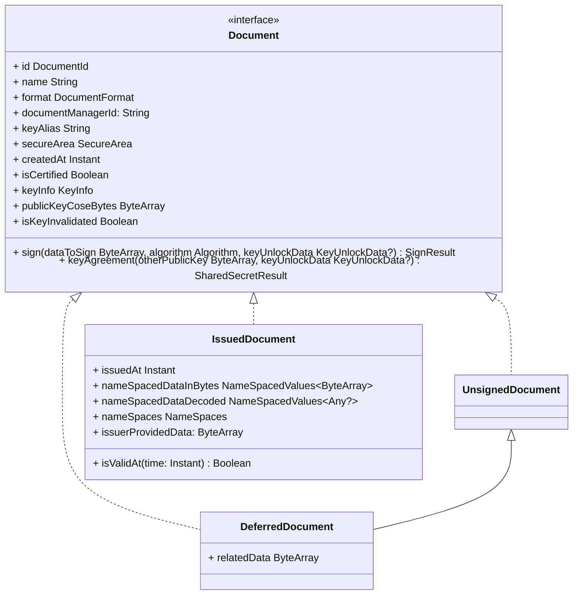

# EUDI Wallet Documents Manager library for Android

:heavy_exclamation_mark: **Important!** Before you proceed, please read
the [EUDI Wallet Reference Implementation project description](https://github.com/eu-digital-identity-wallet/.github/blob/main/profile/reference-implementation.md)

## Overview

This library provides a set of classes to manage documents in an EUDI Android Wallet.

It defines the interfaces for DocumentManager and Document classes and provides a standard
implementation of the DocumentManager interface using Identity Credential library by the
OpenWallet Foundation.

The library is written in Kotlin.

## :heavy_exclamation_mark: Disclaimer

The released software is a initial development release version:

- The initial development release is an early endeavor reflecting the efforts of a short timeboxed
  period, and by no
  means can be considered as the final product.
- The initial development release may be changed substantially over time, might introduce new
  features but also may
  change or remove existing ones, potentially breaking compatibility with your existing code.
- The initial development release is limited in functional scope.
- The initial development release may contain errors or design flaws and other problems that could
  cause system or other
  failures and data loss.
- The initial development release has reduced security, privacy, availability, and reliability
  standards relative to
  future releases. This could make the software slower, less reliable, or more vulnerable to attacks
  than mature
  software.
- The initial development release is not yet comprehensively documented.
- Users of the software must perform sufficient engineering and additional testing in order to
  properly evaluate their
  application and determine whether any of the open-sourced components is suitable for use in that
  application.
- We strongly recommend not putting this version of the software into production use.
- Only the latest version of the software will be supported

## Requirements

- Android 8 (API level 26) or higher

### Dependencies

To use snapshot versions add the following to your project's settings.gradle file:

```kotlin
dependencyResolutionManagement {
    repositories {
      // .. other repositories
        maven {
            url = uri("https://s01.oss.sonatype.org/content/repositories/snapshots/")
            mavenContent { snapshotsOnly() }
        }
    }
}
```

To include the library in your project, add the following dependencies to your app's build.gradle
file.

```kotlin
dependencies {
    // EUDI Wallet Documents Manager library
  implementation("eu.europa.ec.eudi:eudi-lib-android-wallet-document-manager:0.6.0-SNAPSHOT")

    // Optional: Use the identity-android library if you want to use the implementations for StorageEngine and SecureArea
    // for Android devices, provided by the OpenWallet Foundation
  implementation("com.android.identity:identity-android:202408.1")
}
```

### Breaking changes

**Note** that version 0.6.x introduces breaking changes internally to the library.
That means that any stored documents or keypairs with versions up to 0.4.x of the library
will not be available after upgrading to version 0.6.x.

## How to Use

Below is a quick overview of how to use the library.

For source code documentation, see in [docs](docs/index.md) directory.

### Instantiating the DocumentManager

To create an instance of the DocumentManager class, use the DocumentManager.Builder class.
Builder requires a StorageEngine and SecureArea instance to be set before building the
DocumentManager.

The following code snippet shows an example on how to create EphemeralStorageEngine and
SoftwareSecureArea instances, provided by the Identity Credential library, and use them later to
create a DocumentManager instance.

Any implementations of StorageEngine and SecureArea can be used.

```kotlin
import com.android.identity.securearea.software.SoftwareSecureArea
import com.android.identity.storage.EphemeralStorageEngine

val storageEngine = EphemeralStorageEngine()
val secureArea = SoftwareSecureArea(storageEngine)
```

To use the DocumentManager with the Identity Credential library for android, you must add the
`com.android.identity:identity-android:202408.1` dependency to your project, and use the provided
implementations for StorageEngine and SecureArea for Android devices.

```kotlin
val builder = DocumentManager.Builder()
  .setIdentifier("eudi_wallet_document_manager")
  .setStorageEngine(storageEngine)
  .addSecureArea(secureArea)

val documentManager = builder.build()
```

### Managing documents

A document can be in one of the three following states:

- **Unsigned** the document is not yet issued and has no data from the issuer. Contains only the
  keys that will be used for signing the proof of possession for the issuer.
- **Deferred** the document is not yet received from the issuer, but the issuer has received the
  document's public key and proof of possession. It also holds some related to the deferred issuance
  process, that can be used for the completion of issuance.
- **Issued** the document is issued and contains the data received from the issuer

The following diagram depicts the class hierarchy of the Document classes:



The following snippet shows how to retrieve the documents using DocumentManager instance:

```kotlin
val documents = documentManager.getDocuments()
```

You can also retrieve documents based on a predicate. The following snippet shows how to retrieve
documents of mso_mdoc format of a specific docType:

```kotlin
val documents = documentManager.getDocuments { document ->
  (document.format as MsoMdocFormat).docType == "eu.europa.ec.eudi.pid.1"
}
```

The following snippet shows how to retrieve a document by its id:

```kotlin
val documentId = "some_document_id"
val document: Document? = documentManager.getDocumentById(documentId)
```

To delete a document, use the following code snippet:

```kotlin
try {
  val documentId = "some_document_id"
  val deleteResult = documentManager.deleteDocumentById(documentId)
  deleteResult.getOrThrow()
} catch (e: Throwable) {
  // Handle the exception
}
```

### Creating and storing a new document

Adding a new document to the DocumentManager is a two-step process. First, a new document must be
created using the createDocument method. The method returns an UnsignedDocument object that contains
the keys that will be used for signing the proof of possession for the issuer. Creating a new
document requires the document format and the create key settings. The create key settings can be
used to specify the way the keys are created.

After the document is created, the user must retrieve the document's data from the issuer and store
it in the DocumentManager using the storeIssuedDocument method.

The following snippet demonstrates how to create a new document for the mso_mdoc format, using
SoftwareCreateKeySettings implementation provided by the IdentityCredential library. The
implementation of the CreateKeySettings interface must match the SecureArea implementation used by
the DocumentManager.

```kotlin
try {
  // create a new document
  // Construct the createKeySettings that will be used to create the key
  // for the document. Here we use SoftwareCreateKeySettings as an example
  // provided by the identity-credential library
  val createSettings = SecureAreaCreateDocumentSettings(
    secureAreaIdentifier = secureArea.identifier,
    keySettings = SoftwareCreateKeySettings.Builder().build()
  )
  val createDocumentResult = documentManager.createDocument(
    format = MsoMdocFormat(docType = "eu.europa.ec.eudi.pid.1"),
    createSettings = createSettings
  )
  val unsignedDocument = createDocumentResult.getOrThrow()
  val publicKeyBytes = unsignedDocument.publicKeyCoseBytes

  // prepare keyUnlockData to unlock the key
  // probably prompt the user to enter the passphrase
  // or use any other method to unlock the key
  // here we use SoftwareKeyUnlockData as an example
  // provided by the identity-credential library
  val keyUnlockData = SoftwareKeyUnlockData(
    passphrase = "passphrase required to unlock the key"
  )
  // proof of key possession
  // Sign the documents public key with the private key
  // before sending it to the issuer
  val signatureResult =
    unsignedDocument.sign(publicKeyBytes, keyUnlockData = keyUnlockData)
  val signature = signatureResult.getOrThrow().toCoseEncoded()

  // send the public key and the signature to the issuer
  // and get the document data
  val documentData = sendToIssuer(
    publicKeyCoseBytes = publicKeyBytes,
    signatureCoseBytes = signature
  )

  // store the issued document with the document data received from the issuer
  val storeResult =
    documentManager.storeIssuedDocument(unsignedDocument, documentData)

  // get the issued document
  val issuedDocument = storeResult.getOrThrow()
} catch (e: Throwable) {
  // Handle the exception
}

// ...

fun sendToIssuer(publicKeyCoseBytes: ByteArray, signatureCoseBytes: ByteArray): ByteArray {
  TODO("Send publicKey and proof of possession signature to issuer and retrieve document's data")
}
```

**Important!:** In the case of `DocumentFormat.MsoMdoc`, `DocumentManager.storeIssuedDocument()`
method expects
document's data to be in CBOR bytes and have the IssuerSigned structure according to ISO 23220-4.
Currently, the library does not support IssuerSigned structure without the `nameSpaces` field.

The following CDDL schema describes the structure of the IssuerSigned structure:

```cddl
IssuerSigned = {
 ?"nameSpaces" : IssuerNameSpaces, ; Returned data elements
 "issuerAuth" : IssuerAuth ; Contains the mobile security object (MSO) for issuer data authentication
}
IssuerNameSpaces = { ; Returned data elements for each namespace
 + NameSpace => [ + IssuerSignedItemBytes ]
}
IssuerSignedItemBytes = #6.24(bstr .cbor IssuerSignedItem)
IssuerSignedItem = {
 "digestID" : uint, ; Digest ID for issuer data authentication
 "random" : bstr, ; Random value for issuer data authentication
 "elementIdentifier" : DataElementIdentifier, ; Data element identifier
 "elementValue" : DataElementValue ; Data element value
}
IssuerAuth = COSE_Sign1 ; The payload is MobileSecurityObjectBytes
```

### Working with sample documents

The library also provides a `SampleDocumentManager` implementation that can be used to load sample
documents and test the library easily. Currently, the library supports loading sample documents in
MsoMdoc format.

The following code snippet shows how to create an instance of the `SampleDocumentManager` class and
load sample documents:

```kotlin
val sampleDocumentManager = SampleDocumentManager.Builder()
  .setDocumentManager(documentManager)
  .build()

val sampleMdocDocuments: ByteArray = readFileWithSampleData()

val createSettings = SecureAreaCreateDocumentSettings(
  secureAreaIdentifier = secureArea.identifier,
  keySettings = SoftwareCreateKeySettings.Builder().build()
)
val loadResult = sampleDocumentManager.loadMdocSampleDocuments(
  sampleData = sampleMdocDocuments,
  createSettings = createSettings,
  documentNamesMap = mapOf(
    "eu.europa.ec.eudi.pid.1" to "EU PID",
    "org.iso.18013.5.1.mDL" to "mDL"
  )
)

val documentIds: List<DocumentId> = loadResult.getOrThrow()

// ...

fun readFileWithSampleData(): ByteArray = TODO("Reads the bytes from file with sample documents")
```

Method `SampleDocumentManager.loadMdocSampleDocuments()` expects sampleData to be in CBOR format
with the following structure:

```cddl
SampleData = {
 "documents" : [+Document], ; Returned documents
}
Document = {
 "docType" : DocType, ; Document type returned
 "issuerSigned" : IssuerSigned, ; Returned data elements signed by the issuer
}
IssuerSigned = {
 "nameSpaces" : IssuerNameSpaces, ; Returned data elements
}
IssuerNameSpaces = { ; Returned data elements for each namespace
 + NameSpace => [ + IssuerSignedItemBytes ]
}
IssuerSignedItem = {
 "digestID" : uint, ; Digest ID for issuer data authentication
 "random" : bstr, ; Random value for issuer data authentication
 "elementIdentifier" : DataElementIdentifier, ; Data element identifier
 "elementValue" : DataElementValue ; Data element value
}
```

### Other features

```kotlin
import org.json.JSONObject

val document = documentManager.getDocumentById("some_document_id") as? IssuedDocument
val documentDataAsJson: JSONObject? = document?.nameSpacedDataJSONObject
```

## How to contribute

We welcome contributions to this project. To ensure that the process is smooth for everyone
involved, follow the guidelines found in [CONTRIBUTING.md](CONTRIBUTING.md).

## License

### Third-party component licenses

See [licenses.md](licenses.md) for details.

### License details

Copyright (c) 2023 - 2024 European Commission

Licensed under the Apache License, Version 2.0 (the "License");
you may not use this file except in compliance with the License.
You may obtain a copy of the License at

    http://www.apache.org/licenses/LICENSE-2.0

Unless required by applicable law or agreed to in writing, software
distributed under the License is distributed on an "AS IS" BASIS,
WITHOUT WARRANTIES OR CONDITIONS OF ANY KIND, either express or implied.
See the License for the specific language governing permissions and
limitations under the License.
